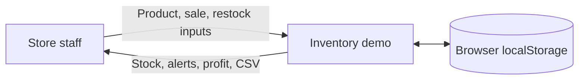
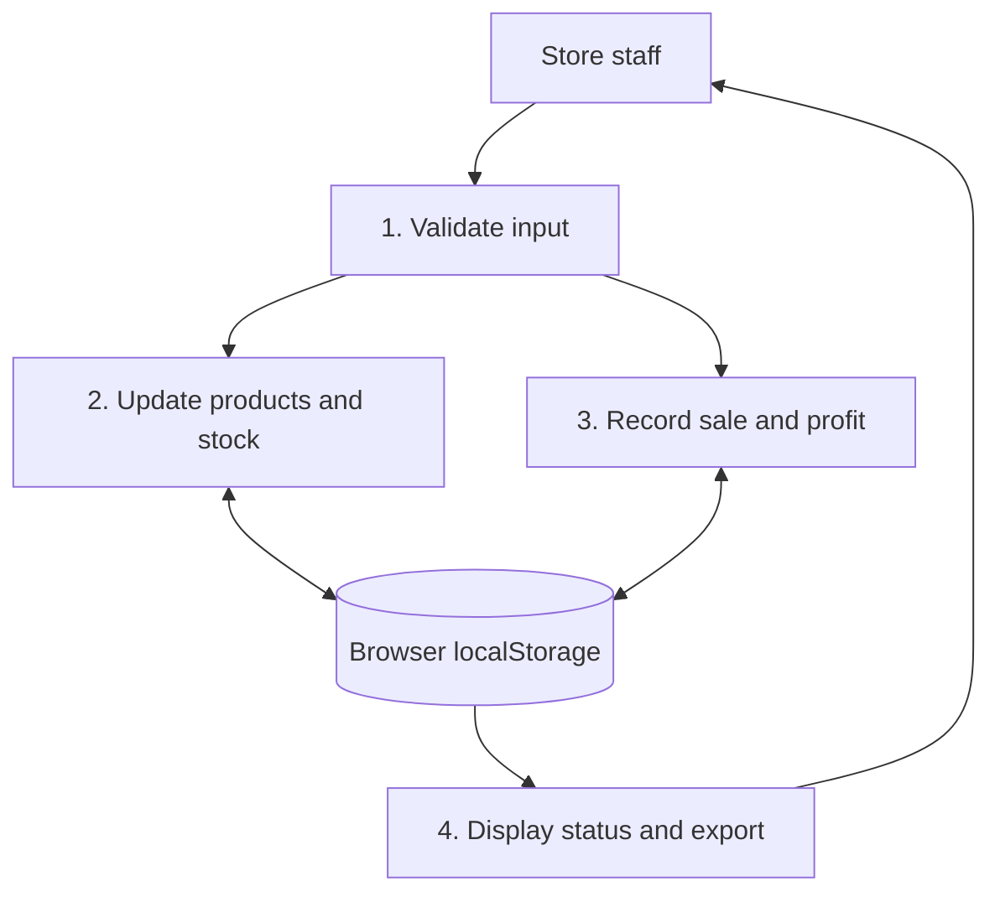

# Inventory demo: simplified data flow

This diagram documents the new portfolio prototype. It is a simplified illustration of the course project's analysis methods, not a reproduction of the original graded diagrams.

## Context

## Level 1 flow

**Boundary:** Only one browser is represented. A future cloud system would need shared storage, accounts, backups, access controls and synchronization across devices.
